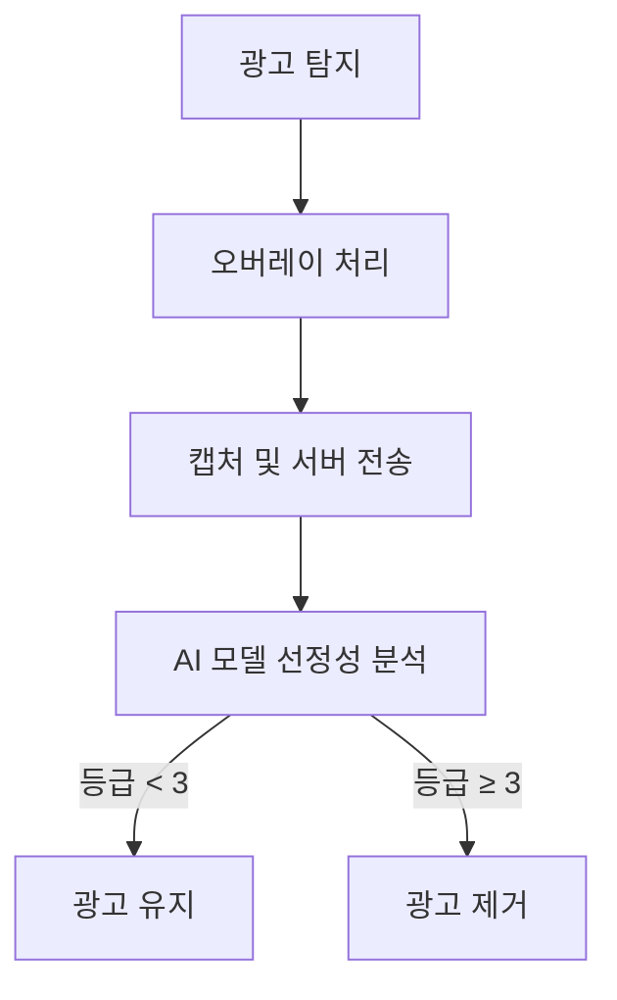

# 🌸 Purify - AI 기반 광고 정화 크롬 확장 프로그램

> **선정적인 광고만 골라서 제거하는**, 사용자 친화적인 광고 정화 솔루션

---

## 📌 프로젝트 개요

뉴스 사이트를 비롯한 다양한 온라인 공간에서는 사용자 맞춤형 광고 시스템의 확산으로 인해  
불특정 다수를 대상으로 한 **선정적 이미지 광고**가 빈번하게 노출되고 있습니다.  
이는 사용자에게 불쾌감을 주는 것은 물론, **청소년에게 왜곡된 성 인식을 심어줄 수 있는 사회적 문제**입니다.

**Purify**는 이러한 문제를 해결하기 위해 개발된 **AI 기반의 광고 정화 확장 프로그램**으로,  
**방송통신심의위원회 SafeNet 등급 기준**을 바탕으로 **유해 광고만을 선별적으로 제거**합니다.

## ✅ 사용자 설문조사 (총 31명 대상)

| 선정적 광고 접촉 빈도              | 비율   |
|-----------------------------------|--------|
| 매우 자주 본다 (하루 1회 이상)     | 29.0%  |
| 가끔 본다 (며칠에 1회)             | 12.9%  |
| 거의 없다 (드물게 보인다)          | 58.1%  |
| 전혀 없다                          | 0.0%   |

| 광고에 대한 느낌 | 비율   |
|------------------|--------|
| 불쾌하다         | 76.5%  |
| 무덤덤하다       | 20.9%  |
| 기타             | 2.6%   |

> 📢 **모든 응답자가 선정적 광고를 접한 경험이 있으며, 76.5%가 불쾌하다고 응답했습니다.**  
> 이는 본 프로젝트의 기술적 필요성과 사회적 타당성을 뒷받침합니다.

## 💡 왜 이 프로젝트가 필요한가?

- 🎯 많은 사용자들이 **선정적인 광고에 자주 노출되고**, 그 중 **대다수가 불쾌감을 느낍니다.**
- ⚠️ 현재는 사후 규제 또는 자율 심의에 의존하고 있어 **청소년 보호에 공백**이 존재합니다.
- 🤖 본 프로젝트는 **AI 기반 실시간 판단 및 제거**를 통해 이 사각지대를 기술적으로 보완합니다.
- 🧠 결과적으로 **콘텐츠 제공자의 수익 구조를 침해하지 않으면서**, 사용자 보호를 실현합니다.

---

## ✨ 주요 기능

- 🎯 **자동 광고 탐지** (iframe, img, div 등)
- 📷 **광고 오버레이 후 이미지 캡처**
- 🧠 **AI 모델 기반 선정성 판단** (노출/성행위 3등급 기준)
- ❌ **기준 이상 광고 자동 제거**
- 🔧 **ON/OFF 스위치 UI 제공**

---

## 🧩 시스템 구조

## 📊 모델 성능 (Test Set 기준)

| 등급 | 구분                 | Precision | Recall | F1-score |
|------|----------------------|-----------|--------|----------|
| 0등급 | 비인물 광고           | 1.000     | 1.000  | 1.000    |
| 1등급 | 노출 거의 없음        | 0.881     | 0.912  | 0.897    |
| 2등급 | 신체 일부 노출        | 0.925     | 0.817  | 0.867    |
| 3등급 | 전신 또는 주요 부위 노출 | 0.881     | 0.952  | 0.915    |

| 등급 | 구분               | Precision | Recall | F1-score |
|------|--------------------|-----------|--------|----------|
| 0등급 | 비인물 광고         | 1.000     | 1.000  | 1.000    |
| 1등급 | 성적 행동 없음      | 0.913     | 0.778  | 0.840    |
| 2등급 | 착의 상태의 접촉    | 0.789     | 0.848  | 0.818    |
| 3등급 | 성적 행위 암시      | 0.839     | 0.881  | 0.860    |

> ✅ **노출 등급과 성행위 등급 모두 높은 정밀도로 분류 가능한 모델 개발 완료**  
> 📊 test set 이미지 수: 노출 기준 총 200장 / 성행위 기준 총 200장

## 🎬 데모

> 📺 클릭 시 YouTube에서 데모 영상을 재생합니다.

---

## 🛠 기술 스택

### 🧩 프론트엔드 (Chrome Extension)

- **HTML/CSS/JavaScript**: 광고 탐지 및 UI 구현
- **Content Script**: 광고 요소 탐지 및 DOM 조작
- **Background Script**: 광고 캡처 (스크린샷) 처리
- **Storage API**: 사용자의 광고 정화 설정 저장
- **Fetch API + FormData**: 광고 이미지 서버 전송 및 결과 수신

### 🔍 AI 서버 (Backend API)

- **Flask**: REST API 서버 구현 (`/predict` 엔드포인트)
- **Flask-CORS**: CORS 문제 해결을 위한 미들웨어 설정
- **Pillow (PIL)**: 광고 이미지 디코딩 및 저장 처리
- **Torchvision Transforms**: 이미지 전처리 및 텐서 변환
- **datetime / os / io**: 파일 저장 및 응답 시간 관리

### 🧠 AI 모델 (Multitask Classifier)

- **PyTorch**: 전체 모델 프레임워크
- **timm (Torch Image Models)**: `convnext_tiny` 백본 사용
- **ConvNeXtMultiTaskModel**: 노출 등급과 성행위 등급을 **이중 출력(dual head)**으로 분류
- **사전 학습 X**: 로컬 데이터셋 기반 fine-tuning
- **분류 방식**: `argmax` 기반의 등급 예측 (0~3 → SafeNet 등급 변환)

---

## 🔍 주요 특징 요약

- ✅ **모든 광고를 차단하지 않음** – 콘텐츠 제공자의 수익을 고려하여 선정 광고만 제거  
- ✅ **노출 / 성행위 등급 분리 판단** – 피부 노출이 없어도 성적 암시를 탐지 가능  
- ✅ **SafeNet 기준 적용** – 공신력 있는 방송통신심의위 등급 체계 기반 분류  
- ✅ **사용자 설정 지원** – 광고 정화 기능 ON/OFF UI 제공  
- ✅ **실시간 클라이언트-서버 연동** – 자동 탐지 및 필터링 동작

---

## 🔮 향후 개발 방향

- [ ] 필터링 기준 세분화 및 사용자 맞춤 설정  
- [ ] 텍스트 기반 선정성 판단 기능 도입  
- [ ] Edge/Whale 등 타 브라우저 호환성 확보  
- [ ] 서버 모델 경량화 및 모바일 대응 강화

---

## 📄 라이선스

MIT License

---

## 🙋‍♀️ 개발자

**이재희 (소프트웨어융합학과)**  
📧 Email: `juventa23@khu.ac.kr`  
💻 GitHub: [github.com/pinkkj]([https://github.com/yourusername](https://github.com/pinkkj))

